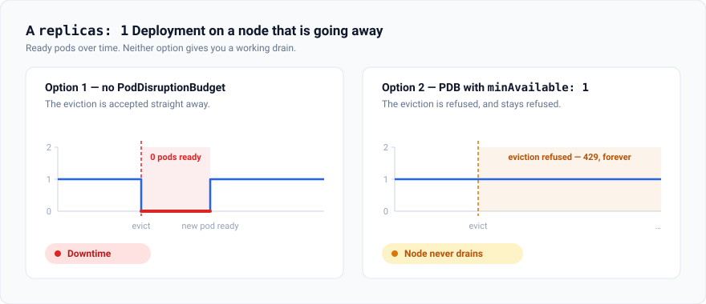
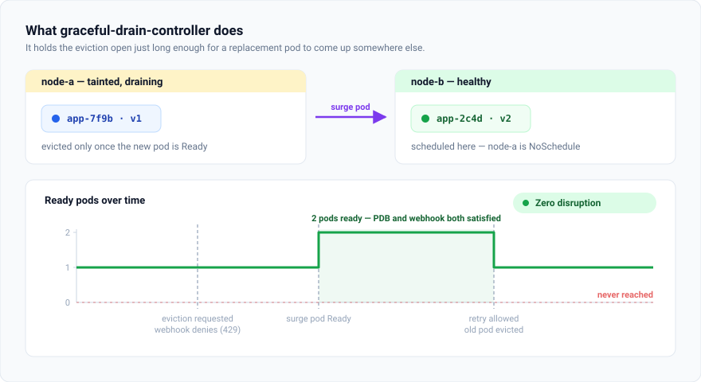
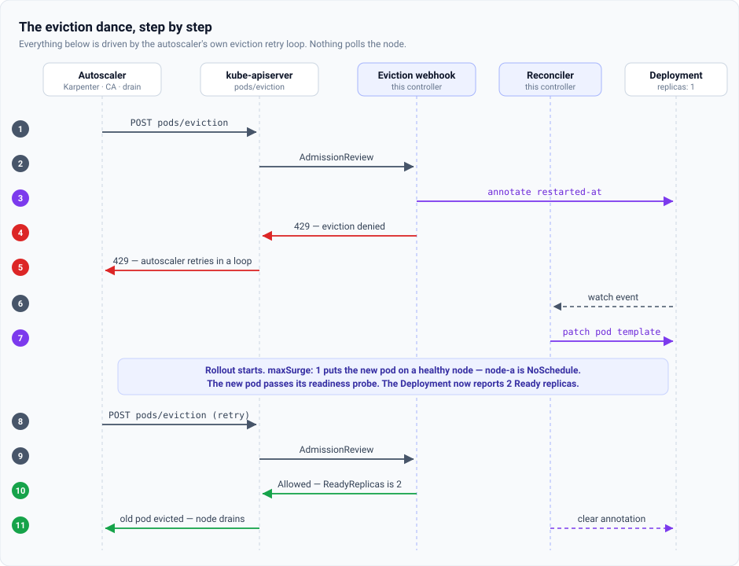

# graceful-drain-controller

[](https://github.com/stonal-tech/graceful-drain-controller/actions/workflows/ci.yml)
[](LICENSE)
[](go.mod)

**Zero-disruption node drains for single-replica Kubernetes Deployments.**

📖 **[Full documentation](https://stonal-tech.github.io/graceful-drain-controller/)**

---

## The problem

Cluster autoscalers remove nodes constantly. Karpenter consolidates, Cluster Autoscaler scales
down, someone runs `kubectl drain` — and they all end the same way: taint the node, then evict
its pods through the Eviction API.

For a Deployment running `replicas: 1`, that leaves two options, and both are bad.



Without a PodDisruptionBudget, the pod is evicted immediately and the service is down until a
replacement is Ready somewhere else. With a PDB of `minAvailable: 1`, the eviction is refused —
but a single-replica Deployment can never satisfy that budget, so the refusal never lifts and
the node never drains.

The honest fix is to run two replicas. That is not always possible: leader-elected controllers,
singleton workers, licensed software and anything holding an exclusive lock are genuinely
single-instance.

## The idea

The disruption exists because the old pod goes away *before* the new one arrives. So make the
eviction wait — not forever, just long enough for a replacement to come up.



The controller registers a validating admission webhook on `pods/eviction`. When an eviction
arrives for the only pod of a `replicas: 1` Deployment, it denies it with `429 Too Many
Requests` — the same status code a PodDisruptionBudget returns, which every autoscaler already
retries — and triggers a rollout restart. The draining node is tainted `NoSchedule`, so the
surge pod lands on a healthy node. Once it is Ready, the next retry is allowed through.

The replica count goes `1 → 2 → 1` and never touches zero.

## How it works



Nothing polls, and nothing watches nodes. The whole flow is driven by the autoscaler's own
eviction retry loop, and all the state lives in one annotation on the Deployment — so
restarting the controller mid-drain costs nothing.

[The detailed walkthrough, including every failure mode →](https://stonal-tech.github.io/graceful-drain-controller/how-it-works/)

## Quick start

Requires [cert-manager](https://cert-manager.io/) (or [your own certificate](https://stonal-tech.github.io/graceful-drain-controller/installation/#bring-your-own-certificate))
for the webhook's serving cert.

```bash
git clone https://github.com/stonal-tech/graceful-drain-controller.git
cd graceful-drain-controller

helm install graceful-drain-controller \
  ./deploy/helm/graceful-drain-controller \
  --namespace kube-system
```

> **Note**
> The `ghcr.io/stonal-tech/graceful-drain-controller` package is currently private. Until it is
> made public you need an image pull secret — see the [installation guide](https://stonal-tech.github.io/graceful-drain-controller/installation/).

Then drain a node and watch it work:

```bash
kubectl drain <node> --ignore-daemonsets --delete-emptydir-data
```

`kubectl` will report `graceful drain: triggered rollout restart, retry later` and keep
retrying — that is the controller doing its job, not a failure.

## What your workloads need

```yaml
apiVersion: apps/v1
kind: Deployment
spec:
  replicas: 1
  strategy:
    type: RollingUpdate
    rollingUpdate:
      maxSurge: 1         # required — create the new pod before removing the old one
      maxUnavailable: 0   # required — never remove the old pod first
  template:
    spec:
      containers:
        - name: app
          readinessProbe:  # required — this is what "the new pod is up" means
            httpGet: { path: /healthz, port: 8080 }
```

No annotations. **No PodDisruptionBudget** — the webhook is the blocking mechanism now, and a
`minAvailable: 1` PDB will [override the controller's timeout escape hatch](https://stonal-tech.github.io/graceful-drain-controller/workloads/#do-not-add-a-poddisruptionbudget)
and can leave a node undrainable.

By default every `replicas: 1` Deployment is protected. Set `enabledAnnotation` at install time
to switch to opt-in mode.

[Preparing your workloads →](https://stonal-tech.github.io/graceful-drain-controller/workloads/)

## Scope

| | |
|---|---|
| **Works with** | Karpenter, Cluster Autoscaler, `kubectl drain`, anything using the Eviction API |
| **Protects** | Deployments with `replicas: 1` |
| **Ignores** | StatefulSets, DaemonSets, bare pods, `replicas: 2+` |
| **Cannot help with** | direct pod deletion (`--disable-eviction`, forced termination), or a cluster with nowhere to put the surge pod |
| **If the controller is down** | evictions proceed normally — `failurePolicy: Ignore` means it fails open |

## Documentation

| | |
|---|---|
| [How it works](https://stonal-tech.github.io/graceful-drain-controller/how-it-works/) | The sequence, the state machine, the failure modes |
| [Installation](https://stonal-tech.github.io/graceful-drain-controller/installation/) | Prerequisites, Helm install, verification |
| [Preparing your workloads](https://stonal-tech.github.io/graceful-drain-controller/workloads/) | Requirements, and why not to add a PDB |
| [Configuration reference](https://stonal-tech.github.io/graceful-drain-controller/configuration/) | Every flag, Helm value, annotation and RBAC rule |
| [Operations](https://stonal-tech.github.io/graceful-drain-controller/operations/) | Events, logs, troubleshooting |
| [FAQ](https://stonal-tech.github.io/graceful-drain-controller/faq/) | |

## Development

```bash
make build   # build the binary
make test    # run tests (requires envtest binaries)
make lint    # golangci-lint
make fmt     # format
```

Tests use controller-runtime's `envtest`, which needs a real API server binary:

```bash
go install sigs.k8s.io/controller-runtime/tools/setup-envtest@latest
eval $(setup-envtest use -p env)
make test
```

## License

[Apache 2.0](LICENSE)
